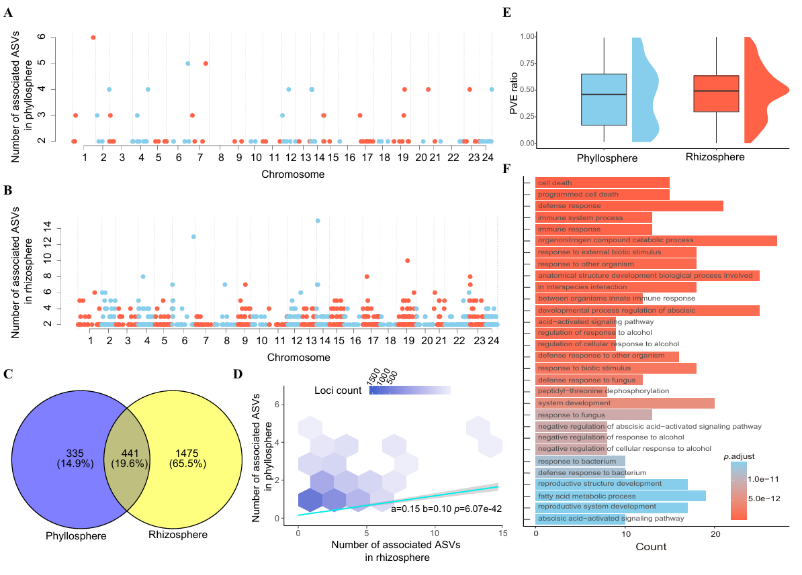
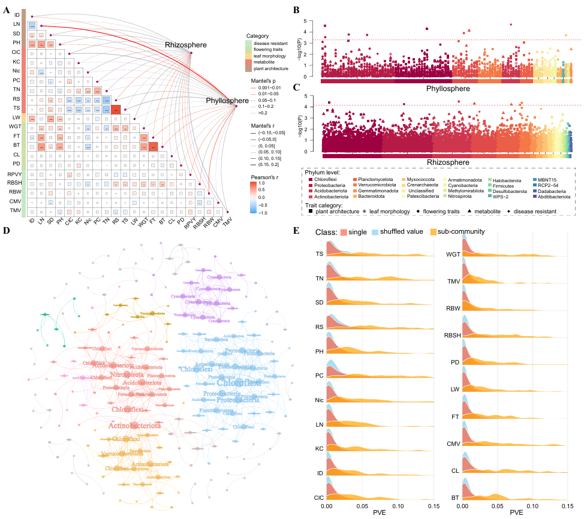
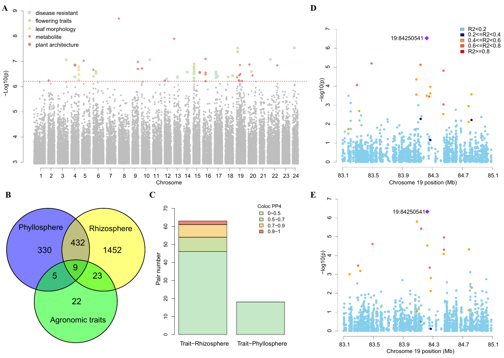
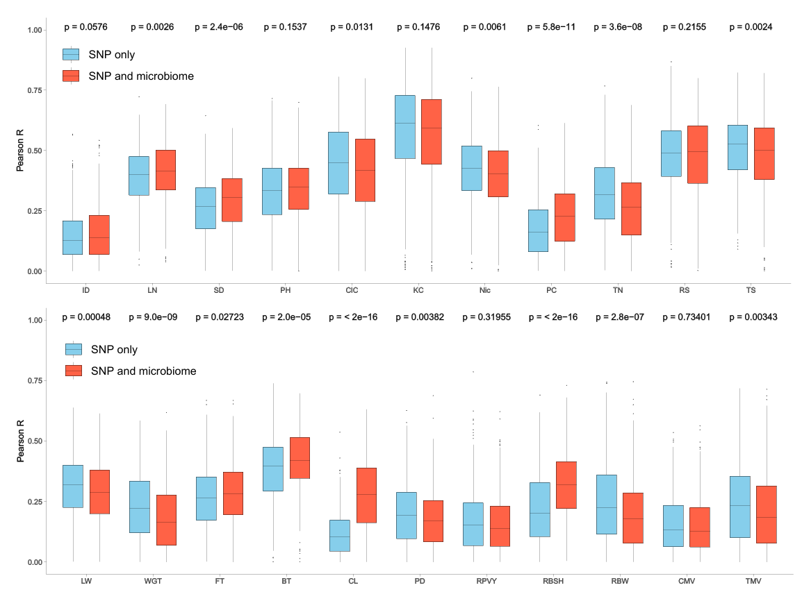

# Host_microbiome_genetic_architecture
 The analysis code for disect the genetic architecture behind microbiome abundance and host interaction.

###第1节标题

第1节内容

###第2节标题

第2节内容

###第3节标题

第3节内容

###第4节标题

第4节内容

###第5节标题

第5节内容

